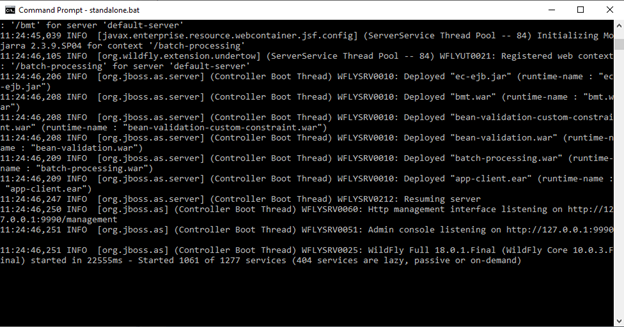
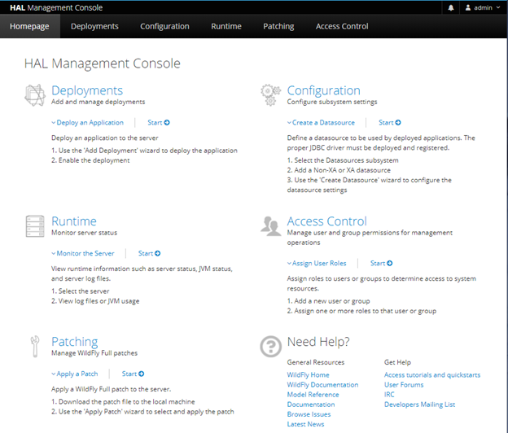
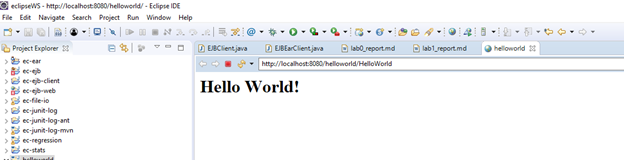
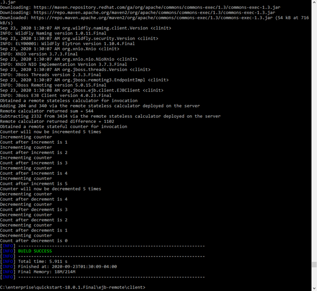
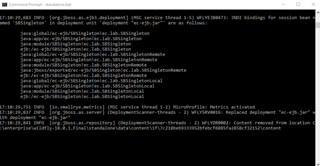
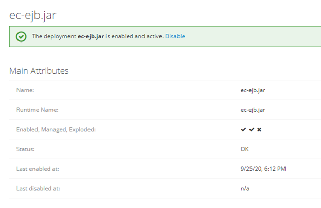
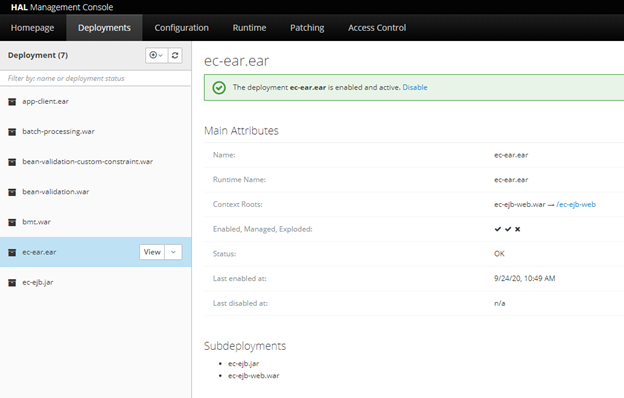
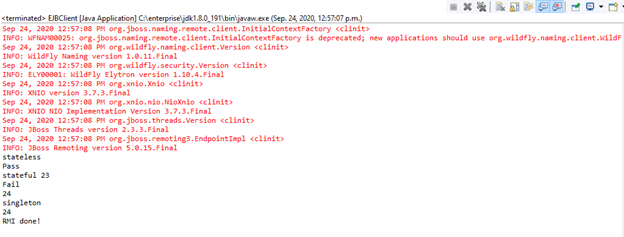

# Lab1 report

Author: Dee Wu    
Date: September 25, 2020

This lab1 report is about setting up JBoss and the development environment, and practicing EJB development.

## WildFly (JBoss-AS)
### JBoss-AS installation

Done

### Set admin and user
Done

## Build and deploy applications by Maven

### Install WildFly quickstart projects

Done

### Testing helloworld project

Done

## JBoss-AS Maven project on Eclipse JEE

### Eclipse Maven and external JBoss
Done.

### Run WildFly within Eclipse JEE
Done.

Undeploy: right click the helloworld object choose remove

## Hand-on EJB projects

### Test ejb-remote project

### Create EJB components

### Client component
Eclipse

Command Console

## Hand-on Web component

### Web component of Servlet

1.5.1.1 Web Component

1.5.1.2 Deploy Management Console

### Web components using EJB

Done

### EJB and Web Components deployment

1.5.3.1 EJB and Web Components deployment

1.5.3.2 Admin web console

1.5.3.3 ec-ejb-client

