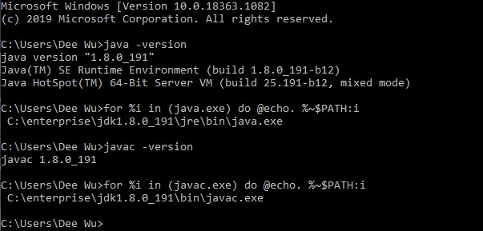
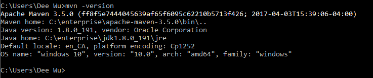
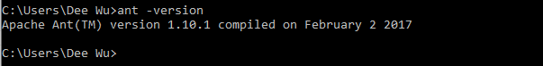

# Lab0 report

Author: Dee Wu    
Date: September 13, 2020

This lab0 report is the implementation of markdown for simple formatted documentations.

## Java JRE & SDK
### Install JRE and JDK

Done

## Build tools

### Apache Maven

Done

### Apache Ant

Done

### Eclipse EE

Done

## Warm up projects

### ec-junit-log.zip
Done.

### ec-junit-log-ant.zip
Done.

### ec-junit-log-mvn.zip
Done.

### ec-file-io.zip
Done.

### ec-stats.zip
Done.

### ec-regression.zip
Done. Exported
